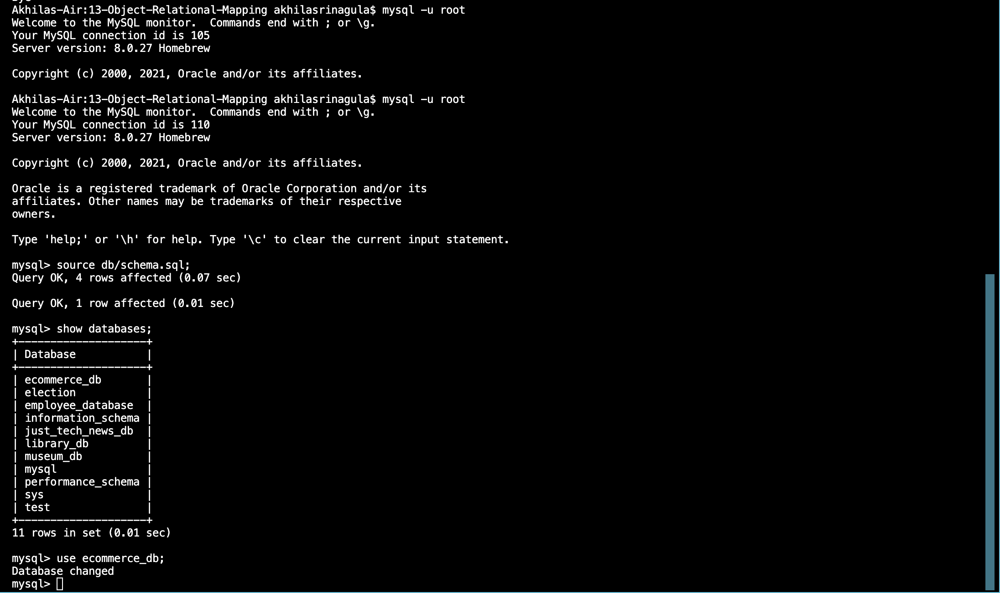

# 13-Object-Relational-Mapping

# Description 

This is a back end application for a e-commerce website that uses the latest technologies. Built using MySQL2, Express, Sequelize and dotenv.

# Installation

Run the following two npm commands in the Integrated Terminal:

* mysql -u root -p.
* On the mysql shell type source db/schema.sql.
* Then, npm run seed.
* And type node server.js to start the server.

# Usage

* To run the application, open the integrated terminal and type node server.js.
* The application can be used to get,post,put and delete data through Insomnia.

## Demo which shows GET routes to return all categories, all products, and all tags being tested in Insomnia:

https://watch.screencastify.com/v/A1KyyN5t39xjvz82kIv7

## Demo which shows GET routes to return a single category, a single product, and a single tag being tested in Insomnia:

https://watch.screencastify.com/v/kc4PIMdvhkXFkAeGlfOJ

## Demo which shows the POST, PUT, and DELETE routes for categories being tested in Insomnia:

https://watch.screencastify.com/v/LEa0hUVXCHBAInyHCzv4

# Preview

# GitHub Repo Link:

# Questions

If you have any questions about the project, contact me at akhilasrinagula@gmail.com
